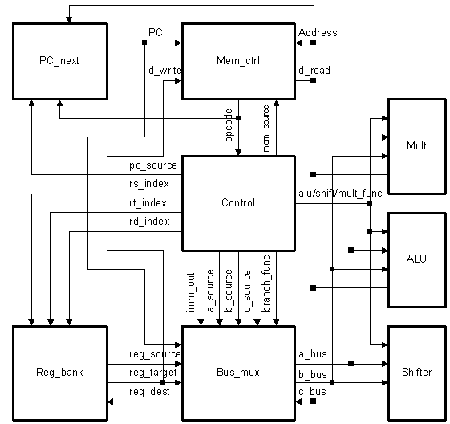
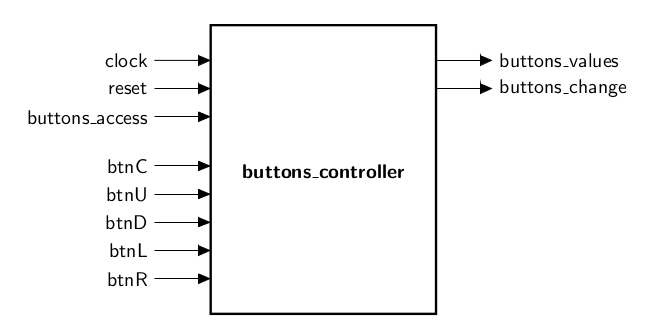
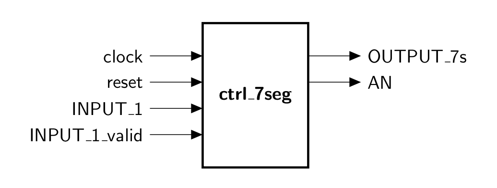
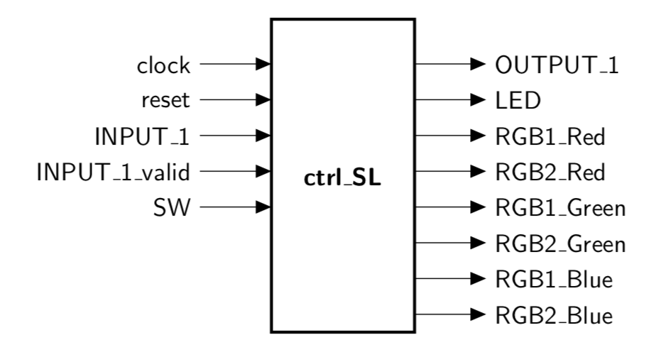
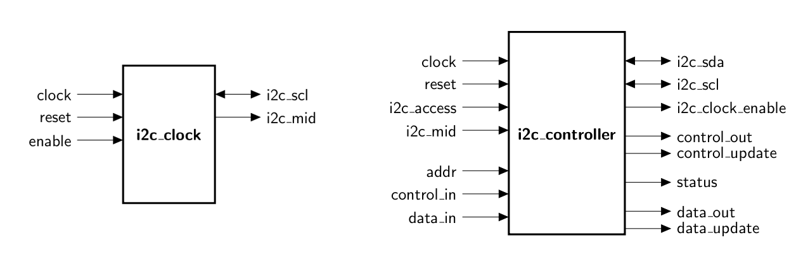
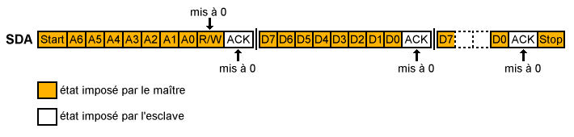
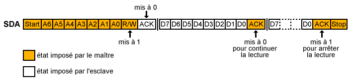

# Documentation

  

- [Introduction](#introduction)
- [Prérequis](#prerequis)
	- [Configuration](#configuration)
	- [Ajout de nouveaux PMODs](#ajout-de-nouveaux-pmods)
	- [Build system](#build-system)
- [Manuel d'utilisation des périphériques sur la carte NEXYS 4](#manuel-dutilisation-des-peripheriques-sur-la-carte-nexys-4)
  - [Boutons](#boutons)
  - [Afficheur sept segments](#afficheur-sept-segments)
  - [Switchs & LEDs](#switchs-&-leds)
- [Module de gestion de l'I2C](#module-de-gestion-de-li2c)

## Introduction
Cette documentation a pour objectif de détailler le principe de fonctionnement de l'architecture du processeur Plasma lors de son utilisation avec divers PMODs. Ce processeur a été instancié sur une puce FPGA *Artix 7* embarquée sur carte *NEXYS 4*. Il est basé sur une architecture RISC 32-bit softcore et est issu d'un projet open source: [**Plasma**](http://opencores.org/project,plasma). Il tourne à une fréquence d'horloge de 25 MHz. L'utilisation des PMODs repose sur une interface plus flexible codée en C et faisant abstraction du langage de description VHDL.

Ce travail a été réalisé dans le cadre d'un projet proposé par Camille Leroux en option SE et développé par Paul Kocialkowski, Henri Gouttard et Igor Papandinas.

  

## Prérequis
Ci-dessous sont listé les outils requis pour l'utilisation du processeur Plasma et les PMODs ou bien l'ajout de nouveaux.

### Configuration
Les outils nécessaire pour l'utilisation du processeur Plasma avec les PMODs sont les suivants:
  * Une carte de développement *NEXYS 4* pour y instancier le plasma et autres modules à utiliser.
  * Le logiciel `Vivado` pour le chargement du bitstream.

**[`^        back to top        ^`](#)**

### Ajout de nouveaux PMODs
Les outils nécessaires pour l'ajout de nouveaux PMODs au processeur Plasma sont les suivants:
  * Les outils cross-compilés pour une architecture MIPS-elf: `mips-elf-gcc`, `mips-elf-as`, `mips-elf-ld`.
  * Le logiciel `Vivado` pour compiler le code VHDL.

Pour commencer il faut développer en VHDL le module correspondant au PMOD que l'on souhaite ajouter. On place ensuite le fichier .vhd de la description dans le répertoire *HDL/PLASMA/*.

Maintenant il faut instancier le module dans l'architecture du plasma. Dans le fichier **plasma.vhd**, on créé donc un component et son port map correspondant avec les signaux internes nécessaires (valid, reset, ...). Puis on définit de nouvelles adresses READ/WRITE (RW) et RESET (RST) que l'on associe aux signaux *valid* et *reset* précedement créé. Cela est fait dans la description VHDL au moment de déclarer les signaux de commandes en direction du port PCIe. Enfin dans le process *misc_proc*, pour le cas où les bits 28 à 30 de *cpu_address* valent "100", on déclare l'adresse de lecture pour notre module (la même que pour valid) à laquelle on associe le signal de sortie du module.

Une fois l'instanciation faite, il ne faut pas oublier de modifier le fichier **top_plasma.vhd** si nécéssaire pour y ajouter les connectiques des périphériques d'entrer et de sortie sur la carte *NEXYS 4*.

Ensuite il faut compiler l'ensemble à partir du *Makefile* dans le répertoire courant du projet (cf la partie détaillant le fonctionnement du fichier Makefile).

Pour terminer, si l'ensemble des instructions précédentes ont bien été suivi, il est maintenant possible d'intéragir dans un programme en C avec le PMOD à partir des adresses utilisées et des fonctions *MemoryWrite()* et *MemoryRead()* (cf les exemples donnés ci-dessous pour d'autres modules tel que le module *Charmap* du PMOD Oled-RGB).

**[`^        back to top        ^`](#)**

### Build system

Le build system utilisé pour le SoC Plasma repose sur le `Makefile` principal qui prend en charge l'ensemble des actions récurrentes relatives au Plasma. 

La liste des fichiers VHDL est définie avec la variable `PLASMA_SOC_FILES`, qui est utilisée pour générer les instructions de synthèse du design. 

Plusieurs paramètres peuvent être configurés au moyen de variables makes passées en argument à la commande :
* `CONFIG_PROJECT` : le projet à utiliser, défaut : `hello`
* `CONFIG_TARGET` : la cible à utiliser (`nexys4_DDR`, `nexys4`), défaut : `nexys4_DDR` 
* `CONFIG_PART` : le FPGA à cibler, défaut : `xc7a100tcsg324-1`
* `CONFIG_SERIAL` : le port série à utiliser pour envoyer le projet, défaut : `/dev/ttyUSB1`

On peut de même activer ou désactiver la prise en charge des différents contrôleurs (qui sont tous activés par défaut) : `CONFIG_UART`, `CONFIG_BUTTONS`, `CONFIG_RGB_OLED`, `CONFIG_SWITCH_LED`, `CONFIG_SEVEN_SEGMENTS`, `CONFIG_I2C`.

Les différentes cibles possibles pour `make` sont présentées :
* `send` : Envoi du binaire du projet vers le Plasma par UART
* `flash` : Programmation du FPGA par JTAG avec OpenOCD
* `plasma` : Préparation du bitstream du SoC Plasma
* `simulation` : Simulation du SoC Plasma avec le projet spécifié
* `clean` : Nettoyage des fichiers temporaires

Des cibles spécifiques pour chacun des projets existent également.

D'autres cibles correspondent à des fichiers internes nécessaires à la préparation du SoC Plasma, tels que les différents outils :
* `convert_bin` : Conversion du format binaire des exécutables MIPS
* `programmer` : Outil d'envoi des binaires des exécutables vers le Plasma par UART

#### Ajout d'un contrôleur

Afin d'ajouter un contrôleur au build system, on définit dans un premier temps une variable de configuration associée à une valeur de *generic* en VHDL :
> CONFIG_BUTTONS ?= yes

Et on ajoute dans un second temps un bloc associant la configuration au *generic* :
>ifeq ($(CONFIG_BUTTONS),yes)  
>PLASMA_SOC_GENERICS += eButtons=1'b1  
>PLASMA_SOC_FILES += buttons.vhd  
>else  
>PLASMA_SOC_GENERICS += eButtons=1'b0  
>endif

Le generic devra par la suite être répercuté dans les fichiers `plasma.vhd`, `top_plasma.vhd` et `tbench.vhd`. Sa valeur par défaut sera (à priori) placée à 1. Un bloc spécifique à l'instantiation du composant sera alors placée dans le fichier `plasma.vhd` tel que :
>	buttons_gen_enabled: if eButtons = '1' generate  
>		plasma_buttons_controller: buttons_controller  
>		port map(  
>			 clock          => clk,  
>			 reset        => reset,  
>			 buttons_access => enable_buttons,  
>			 btnC => btnC,  
>			 btnU => btnU,  
>			 btnD => btnD,  
>			 btnL => btnL,  
>			 btnR => btnR,  
>			 buttons_values => buttons_values,  
>			 buttons_change => buttons_change  
>		);  
>	end generate;  
>  
>	buttons_gen_disabled: if eI2C = '0' generate  
>		buttons_values <= ZERO;  
>		buttons_change <= ZERO;  
>	end generate;

On s'attachera en particulier à connecter les registres associés au contrôleur quand celui-ci est désactivé ainsi qu'à associer des valeurs (préférablement 'Z') aux sorties.

#### Ajout d'un projet

Pour ajouter un projet au build system, on commence tout d'abord par définir un bloc spécifiant les sources et les objets :
>BUTTONS = $(BIN)/buttons.bin  
>BUTTONS_HDL = $(BIN)/buttons.txt  
>BUTTONS_FILES = main.c  
>BUTTONS_SOURCES = $(addprefix $(C)/buttons/Sources/,$(BUTTONS_FILES))  
>BUTTONS_OBJECTS = $(addprefix $(OBJ)/buttons/,$(BUTTONS_FILES:.c=.o))  
>BUILD_DIRS += $(OBJ)/buttons  
>BUILD_BINS += $(BIN)/buttons.bin  
>PROJECTS += $(BUTTONS)

Et on met en place l'association du projet par défaut si c'est celui-ci qui est sélectionné :
>else ifeq ($(CONFIG_PROJECT),buttons)  
>PROJECT = $(BUTTONS)  
>PROJECT_HDL = $(BUTTONS_HDL)

On ajoute enfin les blocs de prise en charge de la compilation du projet à la fois pour l'exécution en RAM ou en ROM au sein du design (utilisé en particulier pour la simulation) :
>$(BUTTONS_OBJECTS): $(OBJ)/buttons/%.o: $(C)/buttons/Sources/%.c | $(BUILD_DIRS)  
>	$(CC_MIPS) $(CFLAGS_MIPS) -o $@ $<  
>  
>$(BUTTONS): $(SHARED_OBJECTS_ASM) $(SHARED_OBJECTS) $(BUTTONS_OBJECTS) $(CONVERT_BIN) | $(BUILD_DIRS)  
>	$(LD_MIPS) -Ttext $(ENTRY_LOAD) -eentry -Map $(OBJ)/buttons/buttons.map -s -N -o $(OBJ)/buttons/buttons.axf $(SHARED_OBJECTS_ASM) $(SHARED_OBJECTS) $(BUTTONS_OBJECTS)  
>	$(CONVERT_BIN) $(OBJ)/buttons/buttons.axf $(OBJ)/buttons/buttons.bin $(OBJ)/buttons/buttons.txt  
>	cp $(OBJ)/buttons/buttons.bin $@  
>  
>$(BUTTONS_HDL): $(SHARED_OBJECTS_ASM) $(SHARED_OBJECTS) $(BUTTONS_OBJECTS) $(CONVERT_BIN) | $(BUILD_DIRS)  
>	$(LD_MIPS) -Ttext $(ENTRY_HDL) -eentry -Map $(OBJ)/buttons/buttons_hdl.map -s -N -o $(OBJ)/buttons/buttons_hdl.axf $(SHARED_OBJECTS_ASM) $(SHARED_OBJECTS) $(BUTTONS_OBJECTS)  
>	$(CONVERT_BIN) $(OBJ)/buttons/buttons_hdl.axf $(OBJ)/buttons/buttons_hdl.bin $(OBJ)/buttons/buttons_hdl.txt  
>	cp $(OBJ)/buttons/buttons_hdl.txt $@  
>  
>.PHONY: buttons  
>buttons: $(BUTTONS) $(BUTTONS_HDL)

**[`^        back to top        ^`](#)**

## Manuel d'utilisation des périphériques sur la carte NEXYS 4

### Boutons

La carte Nexys 4 est équipée de boutons poussoirs qui sont prise en charge par un contrôleur dédié. On peut ainsi relever l'état des boutons et détecter un changement d'état.

#### Fichiers VHDL

Les différents fichiers VHDL qui décrivent la gestion des boutons sont les suivants :
- `plasma.vhd` dans lequel est instancié le contrôleur des boutons et le cablage vers le composant.
- `buttons.vhd` contrôleur pour la prise en charge des boutons.

#### Adresse associée au module

Deux adresses sont utilisées pour le contrôleur de boutons :
- `0x40000100` pour la valeur de l'état des boutons
- `0x40000104` pour la détection du changement de l'état des boutons (XOR avec la valeur précédente)

#### Schéma du contrôleur

  

**[`^        back to top        ^`](#)**

-----------------

### Afficheur sept segments
La carte Nexys 4 est équipée de huit afficheurs sept segments, cablés en anode commune. Il est possible d'obtenir un retour d'information sur ces afficheurs. Le bloc VHDL ajouté à l'architecture du plasma pour la gestion des afficheurs sept segments est semblable aux blocs coprocesseur présents dans le PLASMA.

#### Fichiers VHDL
Les différents fichiers VHDL qui décrivent la gestion des afficheurs sept segment sont les suivants :
- `plasma.vhd` dans lequel est instancié le bloc de gestion de l'afficheur sept segments, les entrées/sorties et signaux pilotant le bloc y sont cablés.
- `ctrl_7seg.vhd` bloc principal où les différents sous-blocs nécessaires à l'affichage sont cablés.
- `mod_7seg.vhd` pour la préparation du signal vers les 7 segments

#### Adresse associée au module
Pour intérgir avec les afficheurs sept-segments une adresse est réservée.
- `0x40000200`: adresse de l'entrée sur 32 bits, il faut écrire les données à cette adresse. Le *macro* associé à cette adresse est `SEVEN_SEGMENT`.

#### Schéma du bloc principal **ctrl_7seg.vhd**

  

#### Comment ça fonctionne ?
Il suffit d'écrire à l'adresse `SEVEN_SEGMENT`, la valeur en entrée sur 32 bits et elle sera affichée en sortie, en écriture héxadécimal, sur les 8 afficheurs sept-segments disponibles sur la Nexys 4.

#### Programme C
Un programme d'exemple est fournit, il implémente un compteur allant de *0* à *2000* (*7DO* en hexadécimal). Le compteur s'incrémente toute les *100ms*. L'affichage de la valeur du compteur est fait sur les afficheurs sept-segment.

Ensuite le programme rentre dans un boucle infinie dans laquelle il affiche les 16 bits de données *switchs*, à la fois sur les quatres afficheurs de droite, et sur les quatres afficheurs de gauche.

**[`^        back to top        ^`](#)**

-----------------

### Switchs & LEDs
La carte NEXYS 4 possède 16 Switchs, 16 LEDs vertes et 2 LEDs RGB. Ce module permet de contrôler l'ensemble. Il est possible d'intéragir avec le plasma et d'obtenir un retour d'information sur ces LEDs. Le bloc VHDL ajouté à l'architecture du plasma pour la gestion des Switchs/LEDs est semblable aux blocs coprocesseur présents dans le PLASMA.
#### Fichiers VHDL
Les différents fichiers VHDL qui décrivent la gestion des Switchs/LEDs sont les suivants :
- `plasma.vhd` dans lequel est instancié le bloc de gestion, les entrées/sorties et signaux pilotant le bloc y sont cablés.
- `ctrl_SL.vhd` bloc principal où les différents sous-blocs nécessaires à l'affichage sont cablés.

#### Adresse associée au module
Pour intérgir avec les afficheurs sept-segments une adresse est réservée.
- `0x400000C4`: adresse de l'entrée sur 32 bits, il faut écrire les données à cette adresse. Le *macro* associé à cette adresse est `CTRL_SL_RW`.

#### Schéma du bloc principal **ctrl_SL.vhd**

  

#### Comment ça fonctionne ?
Il suffit d'enclencher un switch pour allumer la LED verte correspondante au dessus. Un décalage de 16 bits est fait sur la valeur des switchs, ainsi on contrôle les LEDs RGB avec les switchs 1 à 6 (correspondant après décalage au bit 17 à 22). On peut récupérer la valeur des Switchs pour contrôler d'autres PMODs et on peut également écrire à l'adresse `CTRL_SL_RW`, la valeur en entrée sur 32 bits qui affectera l'état des LEDs verte (sur les bits de poids faible 1 à 16) et RGB.

#### Programme C
Un programme d'exemple est fournit dans le fichier *main.c* du répertoire *C/switch_led/Sources/*. Ce programme implémente le contrôle des LEDs à partir des switchs. Cela est fait à partir d'une boucle infinie qui lit et affiche sur le port série l'état des switchs et contrôle l'état des LEDs.

**[`^        back to top        ^`](#)**

## Module de gestion de l'I2C

Les nombreux PMOD *I2C* fournits par Digilent peuvent être interfacés facilement au processeur Plasma via le module *I2C*. Ce module est un hybride en matériel et logiciel. En effet, il est constitué de deux parties :

- Un bloc matériel décrit en *VHDL* qui permet de synchroniser et de gérer bit à bit les émissions/réceptions des signaux qui assurent la communication *I2C*: *SDA* pour les données et *SCL* pour l'horloge.
- Un programme écrit en C bas niveau, qui permet de gérer les séquences d'écriture et de lecture propres au protocole *I2C*.

### Fichiers sources

Les différents fichiers VHDL qui décrivent la gestion des afficheurs sept segment sont les suivants :

- `plasma.vhd` dans lequel est instancié le bloc VHDL du module *I2C*.
- `i2c.vhd` bloc principal qui contient deux entités **i2c_clock** et **i2c_controller**.
- `i2c.h` fichier d'entête que contient les prototype des fonctions nécessaires pour l'établissement d'une communication *I2C*, ainsi que les macros des adresses et masques des  différents registres.
- `i2c.c` fichier C qui contient les fonctions qui permette de gérer les séquences d'écriture et de lecture du protocole *I2C*.

*NB: Le fichier `main.c` contient un programme d'exemple qui gère une communication avec le capteur PMOD compass*

### Schéma des blocs de la partie VHDL du module *I2C*

  

### Adresses des registres associés au module

- `0x40000300`: adresse du registre qui contient l'adresse de l'esclave ciblé dans une communication *I2C*.
- `0x40000304`: adresse du registre de status du module *I2C*.
- `0x40000308`: adresse du registre de contrôle du module *I2C*.
- `0x4000030c`: adresse du registre de données du module *I2C*.

L'écriture ou la lecture sur l'une de ces adresses active le bloc VHDL du module *I2C*.

**[`^        back to top        ^`](#)**

### Séquences d'écriture et de lecture d'une communication i2c

**Séquence d'écriture dans une communication i2c:**

  

**Séquence de lecture dans une communication i2c:**

  

Le module (partie logicielle + partie matérielle) gère ces séquences, il suffira donc pour interfacer un PMOD *I2C* d'utiliser, une à une, les fonctions mises à disposition (voir `i2c.h`).

**[`^        back to top        ^`](#)**

### Exemple d'interface d'un PMOD : Le PMOD boussole

Cet exemple s'appuie sur le programme [`C/i2c/Sources/main.c`](https://github.com/madellimac/plasma_pmod/blob/master/C/i2c/Sources/main.c). Il s'agit là d'une utilisation spécifique au PMOD compass, mais en général la communication avec des capteurs selon le protocole I2C est assez similaire.

Pour bien comprendre ce programme il faut lire la documentation du [`HMC5883L`](https://aerocontent.honeywell.com/aero/common/documents/myaerospacecatalog-documents/Defense_Brochures-documents/HMC5883L_3-Axis_Digital_Compass_IC.pdf), le circuit intégré utilisé dans le PMOD Compass. L'exemple est tiré de la datasheet.

Dans ce programme on trouve deux parties : l'initialisation et la boucle principale.

#### L'initalisation
Dans cette partie on écrit sur les registres appropriés, dans le but de paramétrer l'acquisition comme on le souhaite. Voici les étapes de configuration dans cet exemple :

- Ecriture sur le registre de configuration A de `0x70`: moyennage sur 8 échantillons, 15 Hz, mesure normale
- Ecriture sur le registre de configuration B de `0xA0`: gain de 5
- Ecriture sur le registre de mode de `0x00`: Mode mesure continue
- Attente de 6 ms au moins.

#### La boucle principale

Dans cette partie on effectue les mesures à chaque tour de boucle, dans notre cas cela consiste à venir lire les registres de données du capteur un par un, puis replacer le pointeur de registre pour la prochaine mesure.

*Remarque: Le pointeur de registre s'incrémente à chaque lecture. Après l'initialisation ce pointeur de registre pointe vers le premier registre de données (`0x03`) et on n'aura pas besoin de l'incrémenter manuellement entre chaque registre.*

**Début de boucle**

- Lecture des 6 registres contenant les valeurs
- Stockage en mémoire
- Placement du pointeur de registre sur l'adresse du premier registre de données pour la prochaine mesure.
- Attente de 67 ms au moins pour une fréquence de 15 Hz

**Fin de boucle**

**[`^        back to top        ^`](#)**
