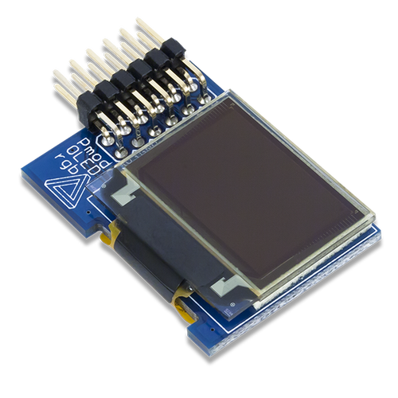

# Tutoriels

- [Introduction](#introduction)
- [Configuration générale](#configuration-générale)
- [Première simulation](#première-simulation)
- [Compilation du bootloader et synthèse du bitstream Plasma](#compilation-du-bootloader-et-synthèse-du-bitstream-plasma)
- [Compilation du projet](#compilation-du-projet)
- [Port série et chargement du binaire du projet par UART](#port-série-et-chargement-du-binaire-du-projet-par-uart)
- [Projets](#projets)
	- [Buttons](#buttons)
	- [Switch/LEDs](#switchleds)
	- [Seven Segments](#seven-segments)
	- [I2C](#i2c)
	- [RGB OLED](#rgb-oled)

## Introduction

Cette série de tutoriels permet de prendre en main le processeur Plasma sur les cartes Nexys 4, au travers des grandes étapes incontournables :

1. Compilation du bootloader
1. Synthèse du bitstream Plasma (incluant le bootloader)
2. Compilation du projet
3. Programmation du bitstream Plasma par JTAG
4. Programmation du binaire du projet par UART

## Configuration générale

On va dans un premier temps configurer la machine hôte pour l'utilisation de *Vivado* en ligne de commande. On prendra soin d'entrer les commandes suivantes dans le terminal de travail (celui on on exécuter *make* par la suite) :

> PATH="$PATH:/net/ens/cleroux/gcc_mips/gnu_toolchain-1.5.4-Linux-i686/bin/"  
> PATH="$PATH:/opt/modelsim/modeltech/bin/:/opt/mentor/modelsim_se/10.3d/modeltech/linux_x86_64/"  
> PATH="$PATH:/opt/xilinx/vivado/2015.2/Vivado/2015.2/bin"  
> export PATH
>
> LM_LICENSE_FILE=2100@johnny  
> export LM_LICENSE_FILE

Il s'agit de spécifier les chemins d'accès aux outils utilisés ainsi que le serveur de licence pour Vivado.

Pour la suite, on se placera dans le dossier racine du projet Plasma, qui contient le *Makefile*.

## Première simulation

On va tout d'abord effectuer la simulation du design matériel et du projet de démonstration par défaut `hello`.

Il s'agit dans un premier temps de compiler l'application pour le processeur MIPS du Plasma puis de lancer la simulation, qui intègre le binaire du projet au sein du design. On effectue la première étape :
> make project

Puis on lance la simulation :
> make simulation

Une fois la simulation terminée, on voit apparaître sur l'écran la chaîne `Hello world !`.

**Astuce** : La première étape est automatiquement exécutée par l'appel à la cible `simulation`, on peut donc se contenter de la seconde étape.

**Astuce** : On peut sélectionner le projet à intégrer en passant `CONFIG_PROJECT` à la cible `simulation` de *make*, par exemple :
> make simulation CONFIG_PROJECT=buttons

## Compilation du bootloader et synthèse du bitstream Plasma

Le bootloader est le composant logiciel qui sera intégré au sein du design matériel du SoC Plasma pour lui permettre d'exécuter des applications sans synthétiser de bitstream spécifique à chaque projet. Il s'agit d'un composant en charge de lire le programme depuis le contrôleur UART (relié au travers de l'USB à l'ordinateur hôte), de le stocker en mémoire et de l'exécuter. Le bootloader est exécuté directement au démarrage par le processeur du Plasma et il est stocké en mémoire morte (ROM), où il ne peut plus être modifié (on parle de **BootROM**).

On peut compiler le bootloader avec la cible `boot_loader` de *make* :
> make boot_loader

Une fois la compilation terminée, on peut observer les fichiers temporaires créés dans le répertoire `OBJ/boot_loader/`. En particulier, c'est le fichier `code_bin.txt` présent dans ce répertoire qui sera utilisé pour la synthèse du Plasma.

On va alors effectuer les étapes permettant d'aboutir à la génération du bitstream dans Vivado:

1. Synthèse du design
2. Optimisation du design
3. Implémentation du design
4. Optimisation physique du design
5. Routage du design
6. Édition du bitstream

Ces étapes sont regroupées au travers de la cible `plasma` de *make* :
> make plasma

Par défaut, le bitstream est généré pour la cible Nexys 4-DDR. Pour générer le bitstream pour la cible Nexys 4, on spécifie `CONFIG_TARGET=nexys4` en argument à *make*:
> make plasma CONFIG_TARGET=nexys4

Cette étape, particulièrement longue, doit être répétée pour chaque modification apportée au design. Il n'est cependant pas nécessaire de la répéter pour des modifications apportées au projet logiciel, grâce à l'utilisation du bootloader.

**Astuce** : La première étape (compilation du bootloader) est appelée automatiquement quand nécessaire par la gestion des dépendances de la règle `plasma` et il est donc dans tous les cas suffisant d'appeler :
> make plasma

## Compilation du projet

On va maintenant compiler le projet que l'on souhaite exécuter sur le Plasma. Comme pour la simulation, le projet par défaut est `hello`.

On appelle *make* avec la cible `project` pour compiler le projet par défaut :
> make project

**Astuce** : On peut sélectionner le projet à compiler en passant `CONFIG_PROJECT` à la cible `project` de *make*, par exemple :
> make project CONFIG_PROJECT=buttons

**Astuce** : Les projets disposent de cibles dédiées que l'on peut également appeler directement, par exemple :
> make buttons

## Programmation du bitstream Plasma par JTAG

Le bitstream ayant été généré, on peut le programmer sur la carte en utilisant le *Hardware Manager* de *Vivado*. Le protocole utilisé pour configurer le circuit logique est le JTAG, qui est accessible depuis le port USB de la carte.

Pour cela, on sélectionne le fichier `BIN/plasma.bit` comme bitstream à charger.

Alternativement, on peut utiliser le logiciel *OpenOCD* qui permet de même de configurer le FPGA par JTAG et dont l'utilisation est intégrée par la commande :
> make flash

Une fois la programmation de la configuration logique terminée, il faut **impérativement** réinitialiser le CPU par un appui sur le bouton rouge marqué *CPU RESET* sur la carte. Un oubli peut laisser des signaux internes non-initialisés et causer des erreurs imprévisibles.

## Port série et chargement du binaire du projet par UART

La FPGA de la carte est maintenant correctement programmé et exécute le bootloader au démarrage.

On peut observer la sortie de l'exécution par le port série UART du Plasma, qui est mis à disposition au travers du connecteur USB. Pour cela, on ouvre un hyperterminal que l'on configure en `115200-8-N-1`.

Comme l'exécution a déjà débuté, aucun message ne s'affiche. Un appui sur le bouton *CPU RESET* de la carte permet de redémarrer l'exécution et ainsi d'afficher la sortie du bootloader.

Le bootloader est maintenant en attente de données depuis le port série. On va y envoyer le programme choisi, avec la cible `send` du *Makefile* :
> make send CONFIG_PROJECT=hello

Par la suite, on adaptera la valeur de la variable `CONFIG_PROJECT` pour qu'elle corresponde au nom du projet que l'on souhaite envoyer.

On pourra au besoin ajuster la variable `CONFIG_SERIAL` pour indiquer un port série différent.

Une fois l'envoi termine, l'exécution du programme débute et on en observe la sortie sur le port série.

## Projets

Différents projet fournis et mettent en œuvre la prise en charge des différents contrôleurs intégrés au SoC Plasma.

### Buttons

Le projet `buttons` prend en charge le contrôleur de boutons poussoirs (situés en haut à droite des afficheurs sept-segments).

* Compilation: `make project CONFIG_PROJECT=buttons`
* Chargement par UART: `make send CONFIG_PROJECT=buttons`
* Code: `C/buttons/Sources/main.c`
* [Documentation](DOCUMENTATION.md#boutons)

Le code `C/buttons/Sources/main.c` va dans un premier temps vérifier si un changement dans l'état des boutons a été détecté (contenu de l'adresse `BUTTONS_CHANGE` différent de 0) et réitérer dans la boucle principale si ce n'est pas le cas :
> if (MemoryRead(BUTTONS_CHANGE) == 0)  
> 	continue

Par la suite, on peut récupérer l'état des boutons à l'adresse `BUTTONS_VALUES` (le changement instantané d'état est donné par la valeur contenue à l'adresse `BUTTONS_CHANGE`). La valeur ainsi récupérée est alors affichée sur le port série.

### Switch/LEDs

Le projet `switch_led` prend en charge le contrôleur dédié aux switchs et aux LEDs (situés en bas de la carte).

* Compilation: `make project CONFIG_PROJECT=switch_led`
* Chargement par UART: `make send CONFIG_PROJECT=switch_led`
* Code: `C/switch_led/Sources/main.c`
* [Documentation](DOCUMENTATION.md#switchs-&-leds)

Il s'agit dans un premier temps de réinitialiser le contrôleur par une écriture à l'adresse `CTRL_SL_RST`. Par la suite, on lit les valeurs des switchs par une lecture à l'adresse `CTRL_SL_RW` et on va écrire cette valeur (pour les LEDs associées) complétée par son décalage de 16 bits vers la gauche (pour les composantes de chaque LED RGB). On affiche de plus la valeur.

La fonction `sleep` permet de temporiser l'exécution d'une durée égale au nombre de millisecondes précisé en argument.

### Seven Segments

Le projet `seven_segments` prend en charge le contrôleur dédié aux afficheurs 7 segments.

* Compilation: `make project CONFIG_PROJECT=seven_segments`
* Chargement par UART: `make send CONFIG_PROJECT=seven_segments`
* Code: `C/seven_segments/Sources/main.c`
* [Documentation](DOCUMENTATION.md#afficheur-sept-segments)

On va utiliser à la fois le contrôleur de switchs présenté précédemment et le contrôleur dédié aux afficheurs sept segments. On initialise les contrôleurs avec des écritures dans les registres dédiés :
> MemoryWrite(SEVEN_SEGMENT_RST, 1);  
> MemoryWrite(CTRL_SL_RST, 1);

Une première boucle affiche l'incrémentation d'une valeur de 0 à 31 sur les afficheurs, avec un pause de 250 ms entre chaque itération.

Une deuxième boucle affiche la valeur sur 16 bits qui correspond à l'état des switchs sur chacun des afficheurs. L'écriture sur les afficheurs est réalisée par une écriture dans le registre `SEVEN_SEGMENT_REG` avec le valeur sur 32 bits contenant l'état des switchs sur chaque paire de 16 bits :
> MemoryWrite(SEVEN_SEGMENT_REG, sw << 16 | sw);

La fonction `sleep` permet de délayer l'exécution du nombre de millisecondes précisé.

### I2C

Le projet `i2c` prend en charge les contrôleurs i2c dédiés au capteur de température externe et aux PMODs I2C connectes sur le port **JA**.

* Compilation: `make project CONFIG_PROJECT=i2c`
* Chargement par UART: `make send CONFIG_PROJECT=i2c`
* Code: `C/i2c/Sources/main.c`, `C/i2c/Sources/i2c.c`
* [Documentation](DOCUMENTATION.md#module-de-gestion-de-li2c)

Les fonctions spécifiques à la prise en charge du contrôleur I2C sur regroupées dans le fichier `i2c.c`. Ces fonctions sont prêtes à être utilisées pour la prise en charge des composants présentés mais elles peuvent être utilisées avec tout contrôleur I2C.

Le contrôleur I2C implémente un comportement de maître pour communiquer avec les esclaves présents sur le bus et adressés par une adresse distincte.

#### Considérations électriques

Le bus I2C fonctionne par une paire de deux signaux bi-directionnels :
* **SCL** : pour l'horloge qui est générée par le maître ;
* **SDA** : pour les données, alternativement utilisées par le maître et l'esclave

Il s'agit ainsi d'un bus half-duplex. Le bus doit être porté à un état logique haut lorsqu'il n'y a pas d'activité : deux résistances de tirage (pull-up) sont donc nécessaires. Des résistances de tirage internes au FPGA sont utilisées sur chacune des lignes, mais celles-si sont trop faibles pour certains composants, qui demandent alors des résistances de tirage externes. Une valeur proche de 10 kOhm est en général adaptée.

#### Capteur de température

Le capteur de température présent sur la carte Nexys 4 est pris en charge au travers de la fonction `tmp_measure` dont on précise le fonctionnement :
* On sélectionne le contrôleur I2C à utiliser (TMP) : `select_mode(SELECT_TMP);`
* On définit l'adresse du composant et la lecture/écriture : `address_set(SLAVE_ADDR_TMP3, READ);`
* On émet la condition de démarrage et l'adresse et on lit la réponse : `start();`
* On lit deux données depuis le composant : `receive_data((unsigned int *) &buf, 2);`
* On émet la condition de fin : `stop();`

La valeur ainsi reçue est alors placée sur 16 bits (on lit successivement le MSB et le LSB sur 8 bits) :
>     value = (short) (buf[0] << 8) + buf[1];

Et on adapte cette valeur pour obtenir la température en millidegré Celcius :
>    value = (value >> 3) * 625 / 10; // m degC

la valeur est ensuite affichée avec un délai de 500 ms entre chaque lecture.

#### PMOD CMPS

Le PMOD CMPS est un capteur de champ magnétique (compas) qui utilise le bus I2C.

Le PMOD doit être relié à la carte Nexys 4 sur le port **JA**. Cependant, les cavaliers **JP1** et **JP2** doivent être présents (ils peuvent éventuellement être manquants mais les pins ne doivent pas être connectés au port JA de la Nexys 4). Un câble d'extension est donc nécessaire et doit être décalé de deux rangées de pins pour éviter les jumpers (ou le spins correspondants).

Le câble doit par la suite être connecté au port JA avec deux rangées de pins de décalage, qui dépasseront du côté des inscriptions JA et 3V3.

Ce PMOD est pris en charge au travers de la fonction `cmps_measure` dont on précise le fonctionnement.

On va tout d'abord configurer certains registres pour activer la prise de mesures en continu :
* On sélectionne le contrôleur I2C à utiliser (PMOD) : `select_mode(SELECT_PMOD);`
* On définit l'adresse du composant et la lecture/écriture : `address_set(SLAVE_ADDRESS_CMPS, WRITE);`
* On émet la condition de démarrage et l'adresse et on lit la réponse : `start();`
* On écrit les données, qui correspondent tout d'abord à l'adresse du registre puis à la valeur à lui affecter:
> send_data(0x00); // CRA register pointer  
> send_data(0x70); // set values
* On émet la condition de fin : `stop();`

L'action est répétée pour plusieurs registres et on lit par la suite 6 valeurs avec un appel à `receive_data`. Ces valeurs sont ensuite reconstituées sur 16 bits (MSB reçu en premier) et affichées sur le port série. À la fin de la lecture, une écriture dans un registre permet de réinitialiser la position du registre pour la lecture afin de pouvoir à nouveau lire les registres des valeurs à la prochaine itération.

la valeur est ensuite affichée avec un délai de 500 ms entre chaque lecture.

#### PMOD Gyro

Le PMOD Gyro est un capteur gyroscope qui utilise le bus I2C.

Le PMOD doit être relié à la carte Nexys 4 sur le port **JA**. Des résistances de tirage externes sont nécessaires pour la prise en charge de ce PMOD : en effet, les résistances internes de la carte sont trop faibles et diminuent la taille du niveau haut d'horloge. Le PMOD doit être connecté par le connecteur **J2**, dont le pin le plus en bas (dans le sens du texte) correspond à VCC.

Ce PMOD est pris en charge au travers de la fonction `gyro_measure` dont on précise le fonctionnement.

On va tout d'abord configurer certains registres pour activer chacun des axes :
* On sélectionne le contrôleur I2C à utiliser (PMOD) : `select_mode(SELECT_PMOD);`
* On définit l'adresse du composant et la lecture/écriture : `address_set(SLAVE_ADDRESS_GYRO, WRITE);`
* On émet la condition de démarrage et l'adresse et on lit la réponse : `start();`
* On écrit les données, qui correspondent tout d'abord à l'adresse du registre puis à la valeur à lui affecter:
>  send_data(0x20); // Select control register1
>  send_data(0x0F); // Normal mode, X, Y, Z-Axis enabled
* On émet la condition de fin : `stop();`

Une deuxième écriture dans un autre registre de contrôle permet d'activer la prise de mesures en continu.

La lecture des données se passe en en deux temps : on va spécifier l'adresse de chacun des registres à lire et lire un seul octet pour chaque registre : l'incrémentation du registre de lecture n'est pas automatique, au contraire du PMOD CMPS.

Pour sélectionner l'adresse du registre :
> send_data(40 + i); // data register

Et pour lire un seul octet :
> receive_data((unsigned int *) &buf[i], 1);

On peut alors reconstruire les données (LSB lu en premier) sur 16 bits :
> x = (short) (buf[1] << 8) + buf[0];

### RGB OLED

Le PMOD OLED RGB permet l'affichage de caractères ASCII sous 8 lignes X 16 colonnes. Il permet aussi de réaliser un affichage Bitmap sous 96X64 avec 16 bits/pixel. Un module d'affichage de jusqu'à 4 courbes a également été instancié (non testé encore).

L'ajout des divers modules de ce PMOD au projet repose sur le travail de Mr. Bornat, détaillé à l'adresse suivante: http://bornat.vvv.enseirb.fr/wiki/doku.php?id=en202:pmodoledrgb.

  

Celui-ci doit être relié à la carte par le port **JB** en bas à droite de la carte.

* Compilation: `make project CONFIG_PROJECT=rgb_oled`
* Chargement par UART: `make send CONFIG_PROJECT=rgb_oled`
* Code: `C/i2c/Sources/main.c`, `C/i2c/Sources/rgb_oled.c`

On trouve des fonctions d'exemple pour chacune des fonctionnalités prises en charge :
* **Charmap** : `rgb_oled_charmap`
* **Bitmap** : `rgb_oled_bitmap`
* **Terminal** : `rgb_oled_terminal`

Chaque module possède une adresse d'activation sur un bit (*oledXXXXXX_valid*) qui passe à '1' au moment d'une lecture ou d'une écriture à l'adresse correspondante au module.

#### Module Charmap

Le module **Charmap** permet l'affichage sur l'écran Oled-RGB d'un caractère ASCII à une position donnée (ligne et colone).
Ce module du PMOD Oled-RGB est adressable aux adresses suivantes:
  * READ/WRITE: OLEDCHARMAP_RW    --> 0x400000A8
  * RESET:      OLEDCHARMAP_RST   --> 0x400000A0

Avant de pouvoir afficher un caractère, il vaut attendre que le module soit prêt à le recevoir. Cela ce traduit par l'activation du bit *Ready* de poids faible en sortie du module *Charmap*. Ainsi on lit à l'adresse définit par le macro *OLEDCHARMAP_RW* ce bit grâce à la fonction *MemoryRead()* et ce jusqu'à qu'il vaille '1'.
Ensuite une fois le module prêt, pour afficher un caractère, il suffit d'écrire à la bonne adresse (*OLEDCHARMAP_RW*) une trame de 32 bits contenant l'ensemble des informations. On utilise pour cela la fonction *MemoryWrite()*.
L'allure de la trame à envoyer est la suivante:
  * la valeur hexadecimal du caractère sur les bits 7 à 0.
  * la valeur hexadecimal de la ligne sur les bits 10 à 8.
  * la valeur hexadecimal de la colonne sur les bits 19 à 16.

Un exemple d'utilisation pour ce module est donné dans le fichier *main.c* du répertoire *C/rgb_oledcharmap/Sources/*.
Pour faciliter l'écriture de la trame à envoyé, une fonction printCar() a été mise en place, prenant en paramètre le caractère, la ligne et la colonne: *void printCar(char row, char col, char car)*.

#### Module Terminal

Le module **Terminal** permet l'affichage sur l'écran Oled-RGB de caractères ASCII en prenant en charge la position. Il est donc plus adapté que le module *Charmap* pour écrire un buffer contenant plusieurs caractères.
Ce module du PMOD Oled-RGB utilise le précedent module *Charmap* et est adressable aux adresses suivantes:
  * READ/WRITE: OLEDTERMINAL_RW   --> 0x400000A4
  * RESET:      OLEDTERMINAL_RST  --> 0x400000AC

De la même manière que pour le module *Charmap*, avant de pouvoir afficher un caractère, il vaut attendre que le module soit prêt à le recevoir. Cela ce traduit par l'activation du bit *Ready* de poids faible en sortie du module *Terminal*. Ainsi on lit à l'adresse définit par le macro *OLEDTERMINAL_RW* ce bit grâce à la fonction *MemoryRead()* et ce jusqu'à qu'il vaille '1'.
Ensuite une fois le module prêt, pour afficher un caractère, il suffit d'écrire à la bonne adresse (*OLEDTERMINAL_RW*) une trame de 32 bits contenant l'ensemble des informations. On utilise pour cela la fonction *MemoryWrite()*.
L'allure de la trame à envoyer est la suivante:
  * la valeur hexadecimal du caractère sur les bits 7 à 0.
  * le bit 24 à '1' pour effacer entièrement l'écran en noir (couleur par défaut): *screen_clear*.

Un exemple d'utilisation pour ce module est donné dans le fichier *main.c* du répertoire *C/rgb_oledterminal/Sources/*.

#### Module Bitmap

Le module **Bitmap** du PMOD Oled-RGB est adressable aux adresses suivantes:
  * READ/WRITE: OLEDBITMAP_RW     --> 0x400000B0
  * RESET:      OLEDBITMAP_RST    --> 0x400000B8

Pour ce module, il n'est pas nécessaire d'attendre que l'écran soit prêt avant de lui envoyer la trame. Pour colorier un pixel, il suffit d'écrire directement à la bonne adresse (*OLEDBITMAP_RW*) une trame de 32 bits contenant l'ensemble des informations. On utilise pour cela la fonction *MemoryWrite()*.
L'allure de la trame à envoyer est la suivante:
  * la valeur hexadecimal de la colonne sur les bits 6 à 0.
  * la valeur hexadecimal de la ligne sur les bits 13 à 8.
  * la valeur hexadecimal de la couleur du pixel sur les bits 16 à 31.
On peut cependant raccourcir à 8 bits la trame de la valeur de la couleur du pixel en modifiant la valeur de BPP dans la description VHDL (*plasma.vhd*). Cette valeur correspond à la profondeur colorimétrique et elle est définit par défaut à 16 bpp ce qui équivaut au mode *Highcolor*.

Un exemple d'utilisation pour ce module est donné dans le fichier *main.c* du répertoire *C/rgb_oledbitmap/Sources/*.
