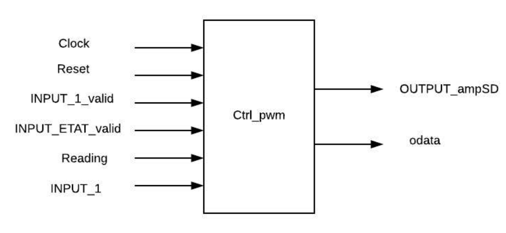
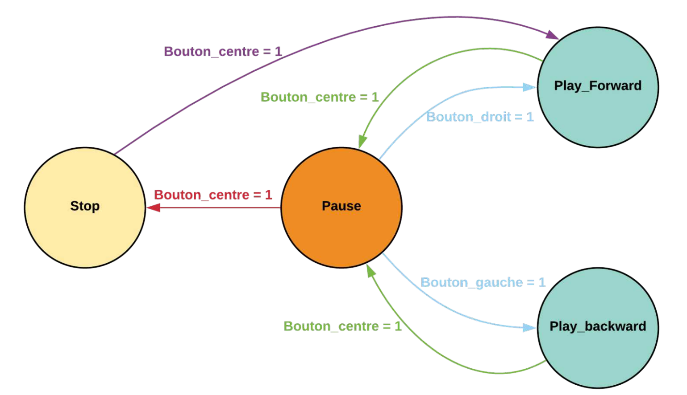

# Wiki du projet Plasma PMOD

Ce dépôt git est dédié à la modification (matérielle et logicielle) du processeur softcore [Plasma](https://opencores.org/project,plasma "Plasma's Homepage") afin de pouvoir gérer des modules PMOD sur les cartes de développement Nexys-4 de Digilent.

* [Documentation](DOCUMENTATION/DOCUMENTATION.md)
* [Tutoriels](DOCUMENTATION/TUTORIELS.md)
* [Memory map](DOCUMENTATION/MEMORY-MAP.md)

 * [Slide](DOCUMENTATION/EN211_Slide.pdf)

# **Documentation du projet : Système de traitement audio**

- [Introduction](#introduction)
- [Manuel d'utilisation](#manuel-dutilisation)
- [Principe du fonctionnement](#principe-du-fonctionnement)
	- [Contrôleur PWM](#contrôleur-pwm)
	- [Envoie d'un tableau de sinus au contrôleur](#envoie-dun-tableau-de-sinus-au-contrôleur)
	- [Envoie de fichiers audio à l'aide de Matlab sur le port UART](#envoie-de-fichiers-audio-à-laide-de-matlab-sur-le-port-uart) 
	- [Afficheur 7-segments](#afficheur-7-segments)
	- [Machine d'état du traitement audio](#machine-détat-du-traitement-audio)
	- [Gestion du volume de l'audio](#gestion-du-volume-de-laudio)
	

## Introduction

Cette documentation a pour objectif de détailler le principe de fonctionnement de notre projet constitué d'un système de traitement audio réalisé sur le plasma dans le cadre du cours EN211. 

## Manuel d'utilisation

Après avoir créé le bitstream *plasma.bit* et le charger sur le FPGA, on compile notre application projet E2 et on envoie le binaire *projet_e2.bin*  vers le FPGA.
Lors du démarrage , en lisant sur le port série à l'aide de la commande *minicom -D /dev/ttyUSB1*, un message s'affiche au terminal (Please send your music from MATLAB) demandant à l'utilisateur d'envoyer le fichier audio. Cette étape sera réalisée avec Matlab, en exécutant le fichier source *push_music.m* qui se trouve au répertoire *plasma_pmod/C/projet_e2*. Une fois le fichier audio est chargé sur le FPGA, un message de confirmation s'affiche au terminal ( Music uploaded! Enjoy it :) ).

 Jusqu'ici, les échantillons de la musique à écouter sont bien stockés dans une RAM dans le FPGA et les afficheurs 7-segments affichent l'état de la machine d'états, un compteur/décompteur de 0 à 599 circulaire et le volume. 

La machine d'états et le volume seront contrôlés par les buttons poussoirs comme suit:

- **Bouton UP :** permet d'augmenter le volume.
- **Bouton DOWN :** permet de diminuer le volume.  
- **Bouton CENTER/RIGHT/LEFT :** Entrées de commande de machine d'états. Au démarrage, l'état est *stop* (en arrêt: On n'entend rien sur la sortie audio). Un premier appui sur le bouton CENTER l'état se change en *Play_Forward* . Un deuxième appui sur le même bouton met la musique en état *pause*. A partir de ce dernier état, l'appui sur le bouton LEFT lance la lecture de la musique en arrière *Play_Backward* et l'appui sur le bouton RIGHT relance la lecture normale *Play_Forward* . Ainsi, un nouveau appui sur le bouton CENTER remet la lecture à zéro (en arrêt).
Cette machine d'états sera bien détaillée dans la suite.        

> Pour pouvoir envoyer une autre chanson autre que celle programmée par défaut dans le plasma, on peut adapter ce dernier en changeant les paramètres génériques dans le *top_plasma.vhd* suivant: 
	 - *MAX_ADDR* qui représente le nombre d'échantillons à considérer.
	 - *FREQ* qui représente le rapport entre la fréquence du plasma 50MHz et la fréquence d'échantillonnage à laquelle la chanson a été enregistrée.    

  
## Principe du fonctionnement

### Contrôleur PWM

#### Schéma du controleur

  
       

- Entrées :
	- Clock : Horloge du circuit fourni par un quartz à 50 MHz.
	- Reset : Remise à zéro asynchrone.
	- INPUT_1_valid : permet de récupérer les échantillons venant sur UART.
	- INPUT_ETAT_valid : permet de récupérer l'état de la machine d'états et le volume.
	- Reading : permet de lancer la lecture du son.
	- INPUT_1 : reliée à l'entrée du plasma.
- Sorties: 
	- OUTPUT_ampSD : set enable pour PWM (Cette sortie est toujours à 1).
	- odata : la sortie audio PWM.

### Envoie d'un tableau de sinus au contrôleur 

Afin de tester notre contrôleur, principalement la transformation des informations numériques représentant l'amplitude du signal audio sous la forme d'un signal au format PWM, nous avons utilisé dans un premier temps un sinus sous forme de tableau d'échantillons à une fréquence 44100 Hz envoyé directement au plasma. 
Après avoir vérifié cette étape, on passera à l'envoi du son par UART puis l'implémentation de la machine d'états.
 
### Envoie de fichiers audio à l'aide de Matlab sur le port UART

Le but global du projet est de pouvoir envoyer du son à travers le port UART de la carte FPGA, le traiter puis le sortir à travers la sortie audio. Pour ce faire, on utilise un script sous Matlab qui va nous permettre d'envoyer les échantillons au contrôleur.

Ceci se fait en chargeant dans un premier lieu le fichier audio à l'aide de la fonction`audioread()`qui donne en sortie une matrice d'échantillons du son et la fréquence d'échantillonnage. Sachant que le plasma ne permet pas le traitement des données de type *float*, on multiplie la matrice par la valeur $2^7$ et on prend les échantillons en *int8*. Ensuite, on configure le port série puis on envoie les échantillons octet par octet.

### Afficheur 7-segments
L'afficheur 7-segments de la carte FPGA sera utilisé pour implémenter une interface du lecteur, qui nous permettra de contrôler la lecture d'une séquence audio.  Le premier afficheur sera consacré aux états du lecteurs audio:
- *C* pour *pause*
- *A* pour *arrêt*
- *F* pour *play_forward* 
- *B* pour *play_backward* 

Les 3 afficheurs suivants afficheront la valeur courante d'un compteur de 1 jusqu'à 599. Finalement, on affichera sur le dernier afficheur un point plus la valeur courante d'un compteur de 1 jusqu'à 7, celle-ci correspondra au volume de l'audio. 

### Machine d'état du traitement audio
La machine d'état du contrôleur audio, présentée ci-dessous, se compose principalement de 4 états : 
 - Pause : Mettre la lecture en pause.
 - Arrêt : Arrêter la lecture avec remise à zéro.
 - Play_Forward : Lire le son.
 - Play_Backward : Lire le son en arrière.

  
       

### Gestion du volume de l'audio

Le volume du son lu par notre contrôleur est géré par un process au sain du *ctrl_pwm*. Le principe est le suivant : On divise l'échantillon audio par la valeur $2^{7-volume}$ où *volume* prend les valeurs 1 ... 6. Sachant que le plasma ne gère pas l'opération de division, on procède par la méthode de décalage à droite. En effet, pour une valeur du volume $n$, on décale à droite la valeur de l'échantillon par $7 - n$.

